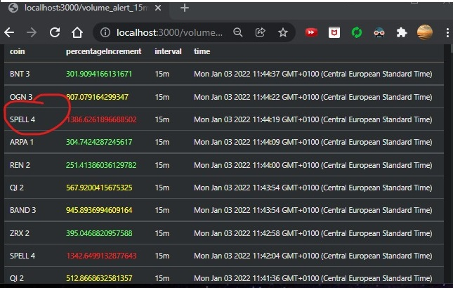
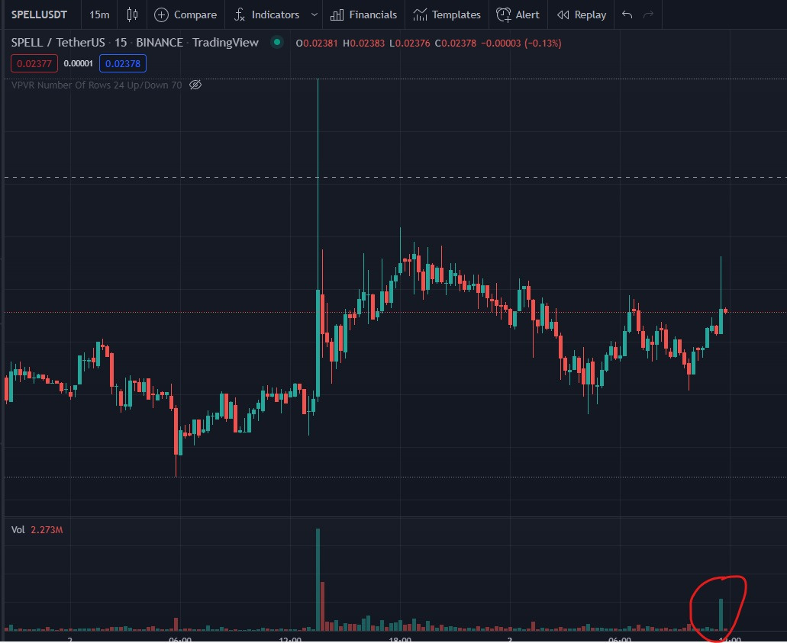

# Crypto analyzer
## Disclaimer
This code should not be used for trading with real money/cryptos or any kind of asset. You are the only responsible of using this product as part of your decissions for trading.

The information provided by this program that can be found in this repository is for general informational purposes only. All information provided by this program is provided in good faith, however we make no representation or warranty of any kind, express or implied, regarding the accuracy, adequacy, validity, reliability, availability or completeness of any information that this program provides.

Under no circumstance shall we have any liability to you for any loss or damage of any kind incurred as a result of the use of this computer program or reliance on any information provided on this program. Your use of this program and your reliance on any information you take from this computer program is solely at your own risk.

## Introduction
This code was designed and built to detect trading opportunities in the crypto market. It can be used to detect spikes in volumes in different time frames. Also designed to detect spikes using indicators such as RSI and MAs golden crosses. It was designed to be used with cryptos. But as it's main input is candle data. You can also use another market data, such as Nasdaq.

The following list shows a spike in volume for SPELL coin:

And in the chart it should look like this:

This will help to detect opportunities for trading

## Stack
1. Digitalocean
2. MongoDb
3. Taapi.io
4. NodeJs
5. Bash
6. Jest
7. Binance API

## Deploy
This code was tested using Digital Ocean but could be used using any cloud services provider such as AWS or Gcloud.

1. Edit .env file and add your taapi.io key
2. Edit .env file and add your mongoDB connection string
3. From your mongoDB client generate your certificate and add it to ca-certificate.crt file. I've used Atlas MongoDb. But another provider could be used.
4. Generate as many droplets as you need in DigitalOcean. You could generate 3: 1 for 1m frame, another for 15m frame, and another one from 1h frame so that your scan is more efficient.
5. Once your droplets have been generated copy the IPs to any of scripts scripts\setupDroplet_one_hour.sh, depending on the time frame you want to cover.
6. Open a bash terminal.
7. Execute command such as: `bash scripts\setupDroplet_one_hour.sh` This script will update node in the droplet and start analyzing coins:
   1. First it will update all coins which have got usdt as pair in Binance. As today, more a less 380 coins.
   2. Then it will iterate through all the coins and store the value in MongoDb.
   3. Once it finishes iterating coins, it will gather again the list of coins from binance and start iterating again.

## Showing lists in the front end
The frontend part was decoupled from this project and added in https://github.com/tomasfly/CryptoVisualizer-FE

## Further changes
I would appreciate that you fork this project and add more funcionalities. Some of the things that could be added are:

1. Dockerize the clients. For example with a NodeJs image.
2. Add support with more indicators. For now we have MA alerts and RSI alerts.
3. Customize alerts to be sent by mail.
4. Backtesting based on alerts.
5. Automate trades.
6. Add support for more exchanges which are not binance.
7. Add support and configuration for more pairs. For now it was designed to scan only USDT pairs in binance

